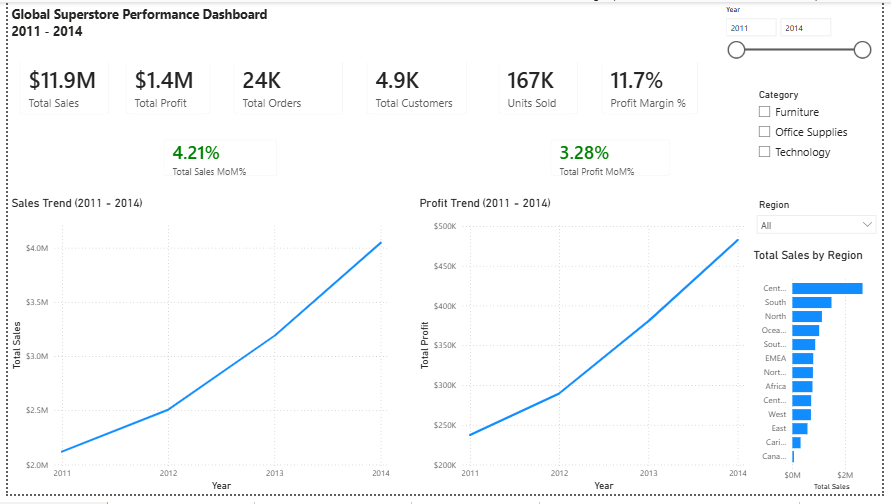
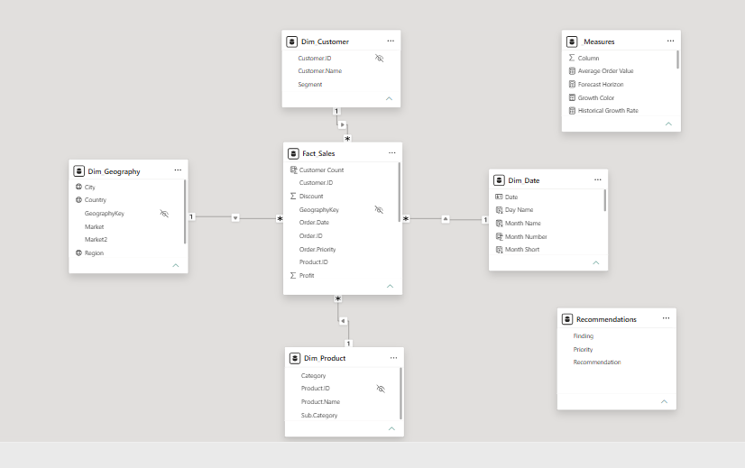
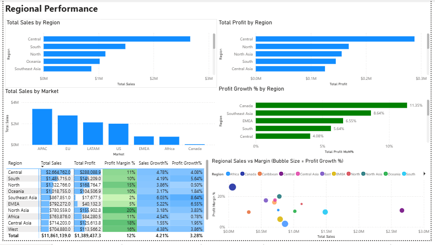
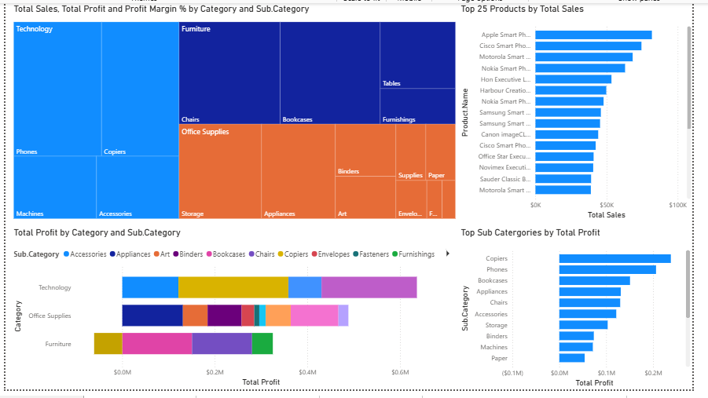
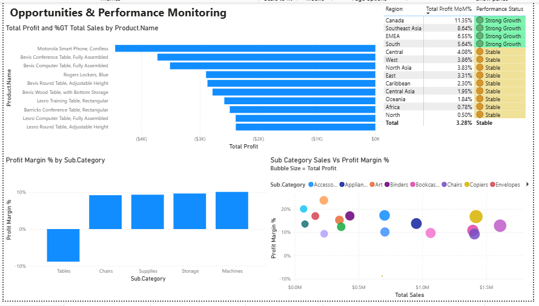
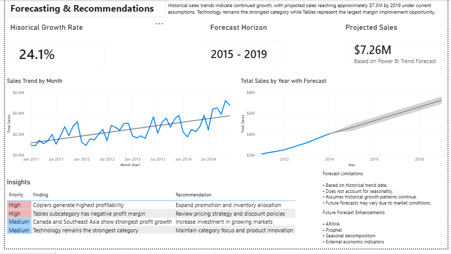

# Global Superstore Performance Dashboard

## Power BI Business Intelligence Reporting Solution



---

# Project Overview

The **Global Superstore Performance Dashboard** is an end-to-end Business Intelligence reporting solution built in **Power BI** using the Global Superstore dataset (51,290 records from 2011-2014).

This project was developed as the Power BI evolution of my Python-based **Superstore Reporting Automation Solution**, translating business logic into a modern BI reporting environment using:

- Power BI
- Power Query
- DAX
- Star Schema Data Modeling
- Interactive Dashboards
- Performance Monitoring
- Forecasting
- Business Recommendations

The dashboard provides executive visibility into sales performance, profitability, regional trends, product performance, and future business opportunities.

---

# Business Problem

Business leaders require a centralized reporting solution that enables them to:

- Monitor overall business performance
- Track sales and profit growth
- Analyze regional and market performance
- Identify profitable products and categories
- Detect low-performing areas requiring attention
- Forecast future business performance
- Support data-driven decision-making

This solution was designed to provide executive reporting and self-service analytics capabilities.

---

# Dataset

### Source

Global Superstore Dataset

### Records

**51,290 transactions**

### Time Period

**2011 – 2014**

### Core Metrics

- Sales
- Profit
- Quantity
- Discount
- Shipping Cost

---

# Data Model

A star schema was developed to support scalable analytics and improve reporting performance.



## Fact Table

### Sales_Fact

Transaction-level sales records.

Key fields:

- Order ID
- Order Date
- Customer ID
- Product ID
- Geography Key
- Sales
- Profit
- Quantity
- Discount
- Shipping Cost

## Dimension Tables

### DimDate

- Year
- Quarter
- Month
- Month Name
- Year-Month
- Year-Quarter

### DimCustomer

- Customer ID
- Customer Name
- Segment

### DimProduct

- Product ID
- Product Name
- Category
- Sub-Category

### DimGeography

- Geography Key
- Market
- Region
- Country
- State
- City

---

# Power Query Transformations

Power Query was used to prepare and enrich the dataset.

Transformations included:

- Data Validation
- Missing Value Review
- Date Standardization
- Year Extraction
- Quarter Extraction
- Month Extraction
- Month Name Creation
- Year-Month Generation
- Year-Quarter Generation
- Star Schema Preparation

---

# DAX Measures

Core business KPIs were implemented using DAX.

## Executive KPIs

```DAX
Total Sales
Total Profit
Total Orders
Total Customers
Units Sold
Profit Margin %
Average Order Value
```

## Growth Metrics

```DAX
Sales Growth %
Profit Growth %
```

## Monitoring Metrics

```DAX
Performance Status
```

Performance classifications:

- Strong Growth
- Stable
- Decline

---

# Dashboard Pages

## Executive Summary

Provides an executive-level overview of business performance.

### Features

- KPI Cards
- Sales Trend Analysis
- Profit Trend Analysis
- Profit Margin Monitoring
- Growth Tracking
- Interactive Filters


---

## Regional Performance

Analyzes business performance across markets and regions.

### Features

- Sales by Region
- Profit by Region
- Sales by Market
- Profit Growth by Region
- Regional Performance Matrix
- Multi-Variable Scatter Analysis

### Business Questions

- Which regions generate the most revenue?
- Which regions are most profitable?
- Which regions are growing fastest?



---

## Product & Category Analysis

Provides visibility into category and product-level performance.

### Features

- Category Treemap
- Top 25 Products by Sales
- Profit by Category and Sub-Category
- Top Sub-Categories by Profit
- Profitability Tooltips

### Business Questions

- Which products drive sales?
- Which categories generate profit?
- Which subcategories create the most business value?



---

## Opportunities & Performance Monitoring

Highlights growth opportunities and underperforming areas.

### Features

- Bottom Products by Profit
- Lowest Margin Sub-Categories
- Regional Performance Status
- Opportunity Scatter Analysis

### Performance Framework

Regions are classified as:

- Strong Growth
- Stable
- Decline

### Key Findings

- Tables subcategory exhibits negative profit margins.
- Canada demonstrates strongest profit growth.
- Southeast Asia maintains strong growth momentum.
- Several table products generate negative profitability.



---

## Forecasting & Recommendations

Combines historical trend analysis with business recommendations.

### Forecast Results

- Historical Growth Rate: 24.1%
- Forecast Horizon: 2015-2019
- Projected Sales: $7.26M

### Forecast Limitations

- Based on historical trend analysis
- Assumes continuation of historical growth patterns
- Does not account for seasonality
- Market conditions may impact future accuracy

### Future Enhancements

- ARIMA Forecasting
- Prophet Forecasting
- Seasonal Decomposition
- External Economic Indicators



---

# Key Business Insights

## Product Performance

- Copiers generated the highest profitability.
- Technology remained the strongest category.
- Tables represented the largest profitability concern.

## Regional Performance

- Canada achieved the strongest profit growth.
- Southeast Asia demonstrated significant growth potential.
- Central region generated the highest sales volume.

## Opportunities

- Review pricing and discount strategy for Tables.
- Expand investment in high-growth regions.
- Increase focus on highly profitable product categories.
- Continue investment in Technology products.

---

# Skills Demonstrated

## Power BI

- Dashboard Development
- Interactive Reporting
- Data Visualization

## Power Query

- Data Transformation
- Data Preparation
- Data Modeling

## DAX

- KPI Development
- Growth Analysis
- Performance Monitoring
- Business Logic Implementation

## Analytics

- Forecasting
- Trend Analysis
- Profitability Analysis
- Executive Reporting

## Data Modeling

- Star Schema Design
- Fact Table Design
- Dimension Modeling

---

# Future Improvements

Potential future enhancements include:

- Forecasting with ARIMA and Prophet
- Automated data refresh pipelines
- Row-level security implementation
- Power BI Service deployment
- Executive scorecards
- Advanced drill-through reporting

---

# Repository Contents

```text
README.md
Global_Superstore_Performance_Dashboard.pbix

images/
├── executive_summary.png
├── regional_performance.png
├── product_analysis.png
├── opportunities_monitoring.png
├── forecasting_recommendations.png

documentation/
├── data_model.md
├── dax_measures.md
├── business_insights.md
└── forecasting_notes.md
```

---

# Author

Thomas Proferes

Business Intelligence | Power BI | SQL | Python | Data Analytics

This project demonstrates the development of an end-to-end Business Intelligence reporting solution using dimensional modeling, Power Query, DAX, forecasting, and executive reporting best practices.
